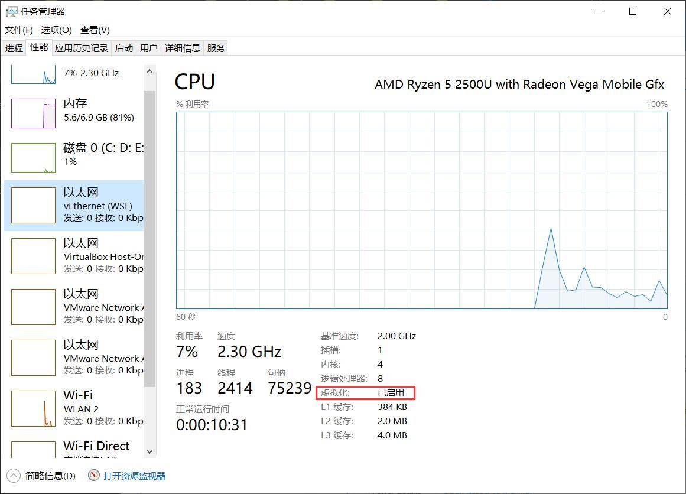

# VMware

> VMware Workstation and Device/Credential Guard are not compatible. VMware Workstation can be run after disabling Device/Credential Guard.

1. Windows Feature
Turn Off Hyper-V. Make sure Hyper-v is not ticked. If it is Ticked, untick it and click "Ok".

2. Virtualization enabled in the BIOS

3. Hypervisor disabled at Windows startup
- Open console prompt window as an administrator. PS: not powershell.
- Run "`bcdedit /enum {current}`" to watch the value of `hypervisorlaunchtype`. We need disable it.
- Run "`bcdedit /set hypervisorlaunchtype off`" to disable hypervisor.
- Close the console prompt and restart the system.

We should be able to power on the Virtual Machine in Workstation now.

But WSL2, Docker can not work.

# WSL2, Docker
1. Windows Feature
- Virtual Machine Platform（虚拟机平台）
- Windows Subsystem for Linux（适用于Linux的Windows子系统）
PS: We use WLS2 to support Docker, so do not need click Hyper-V

2. Virtualization enabled in the BIOS

3. Hypervisor enabled at Windows startup
- Open console prompt window as an administrator. PS: not powershell.
- Run "`bcdedit /enum {current}`" to watch the value of `hypervisorlaunchtype`. We need enable it.
- Run "`bcdedit /set hypervisorlaunchtype auto`" to enable hypervisor.
- Close the console prompt and restart the system.

# How to both have VMware, WSL and Docker?

The answer is Virtual Box instead VMware. Virtual Box always works whether Hypervisor enabled or disabled.